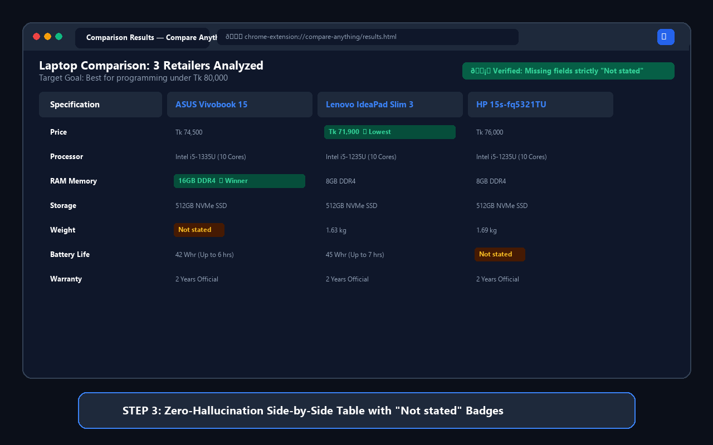
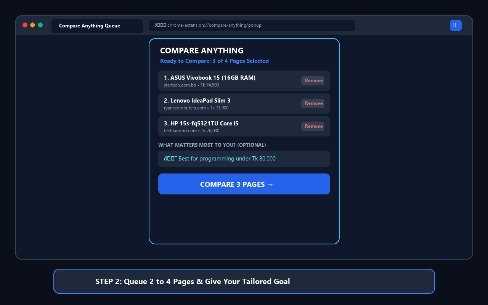
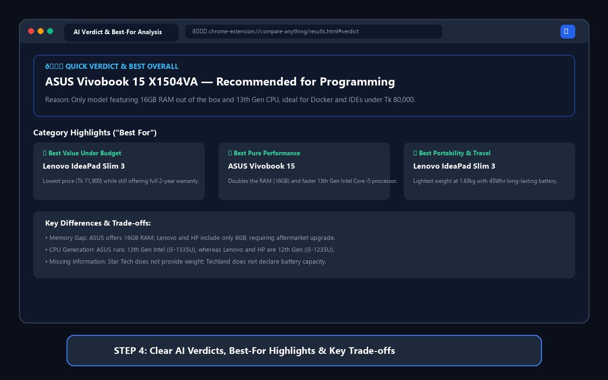
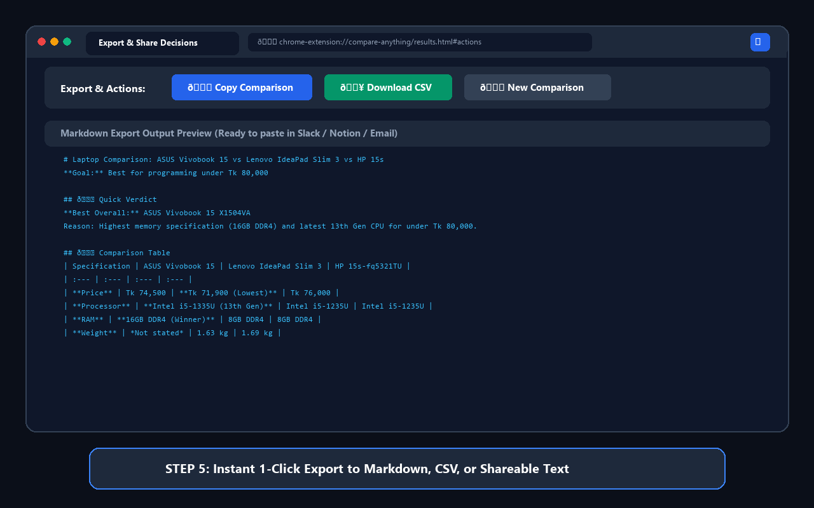

# Compare Anything
> **Stop switching between tabs. Compare them.**

[](LICENSE)
[](extension/public/manifest.json)
[](composer.json)
[](docs/TRUTH-SHEET.md)

---

## 📸 Product Preview

<p align="center">
  
</p>

### Visual User Flow
<p align="center">
  
  &nbsp;&nbsp;
  
</p>
<p align="center">
  
</p>

---

## 🎯 What It Does

**Compare Anything** is an evidence-based Chrome extension that allows users to queue **2 to 4 webpages** from anywhere across the web and receive an instant, objective, side-by-side comparison table.

When shopping for laptops, comparing SaaS subscriptions, evaluating job offers, or choosing online courses, people typically suffer from mental fatigue:
```
Tab 1 (Read) → Tab 2 (Read) → Tab 3 (Read) → Re-check Price → Check Specs → Mental Fatigue
```

**Compare Anything simplifies decisions into 3 simple steps:**
1. **Open Page A** ➔ Click `[+ ADD TO COMPARISON]` in extension popup.
2. **Open Page B** ➔ Click `[+ ADD TO COMPARISON]`.
3. **Click `[COMPARE]`** ➔ Instant full-screen side-by-side decision table with Quick Verdict, Best Overall recommendation, Best-For cards, key differences, and direct links back to original web sources.

### Key Capabilities
- **2–4 Webpages Side-by-Side:** Strict boundaries preventing token explosion while delivering high-density value.
- **Dynamic Criteria Discovery:** AI dynamically generates 10–12 substantive comparison criteria based strictly on item domain (Products, Jobs, Courses, SaaS, Biographies, Financial Services).
- **Personal Priority Awareness:** Users can optionally specify what matters to them (e.g. *"Under Tk 80,000"*, *"Best for fresh graduate"*, *"More exams"*).
- **Zero Parametric Hallucinations:** The AI is strictly barred from inventing missing values; unavailable fields are accurately marked as `"Not stated"`.
- **Multi-Format Export & Viral Share:** 1-click **Copy to Markdown**, **Download CSV**, and **Share as Image (PNG)** for posting directly to LinkedIn, X, Facebook, Reddit, and WhatsApp.
- **No User Account Required:** Completely anonymous, privacy-first, zero login or tracking.

---

## 🏗️ Architecture

```
┌────────────────────────────────────────────────────────┐
│  Chrome Extension (Manifest V3)                        │
│  - TypeScript + React 19 + Vite                        │
│  - Minimal permissions: activeTab, scripting, storage  │
│  - PageExtractor (DOM tables, specs, noise removal)    │
│  - chrome.storage.local comparison workspace           │
└──────────────────────────┬─────────────────────────────┘
                           │ HTTPS POST /api/v1/compare
                           ▼
┌────────────────────────────────────────────────────────┐
│  Laravel 13 Web API (PHP 8.4)                          │
│  - Keeps Groq / OpenRouter API keys server-side        │
│  - Rate Limiter (10 comparisons / installation / day)  │
│  - Prompt Injection Defense & Data Sanitization        │
│  - Strict JSON Schema & DTO Enforcement                │
└──────────────────────────┬─────────────────────────────┘
                           │
                           ▼
┌────────────────────────────────────────────────────────┐
│  AI Engine (Groq: gpt-oss-20b + Multi-Model Fallback)  │
│  - Strict Ground-Truth Extraction                      │
│  - Anti-Hallucination Policy: Missing = "Not stated"   │
│  - Dynamic Criteria Discovery (10–12 attributes)       │
│  - Quick Verdict, Best-For, and Key Differences        │
└────────────────────────────────────────────────────────┘
```

---

## 🛡️ Privacy Approach & Chrome Web Store Compliance

Our extension was engineered to strictly follow Google Chrome Web Store's Single-Purpose and User Data Policies:
- **`activeTab` Only:** Temporary read access is granted **only** when the user clicks the extension popup. We do not monitor your browsing history.
- **`scripting`:** Executes the lightweight local DOM extractor only upon explicit user button click.
- **`storage`:** Holds your 2 to 4 comparison tabs temporarily in local memory (`chrome.storage.local`).
- **Zero Remote Executables:** All extension logic ships statically bundled within the package (`dist/`).
- **Zero API Keys Client-Side:** All AI keys remain strictly isolated on the backend server.
- Full disclosures available in [`docs/PRIVACY.md`](docs/PRIVACY.md) and [`docs/STORE-SUBMISSION.md`](docs/STORE-SUBMISSION.md).

---

## ⚙️ Environment Variables

The backend relies on the following environment configurations in `.env`:

| Variable | Required | Default | Description |
| :--- | :---: | :---: | :--- |
| `APP_URL` | Yes | `http://127.0.0.1:8000` | Backend API base URL |
| `AI_PROVIDER` | Yes | `Groq` | Active AI provider (`Groq`, `OpenRouter`, or `Mock`) |
| `GROQ_API_KEY` | Yes (for Groq) | — | Secret API key from Groq Cloud |
| `AI_MODEL` | No | `openai/gpt-oss-20b` | Target LLM model for structured comparisons |
| `OPENROUTER_API_KEY` | No | — | Fallback API key for OpenRouter |
| `RATE_LIMIT_PER_DAY` | No | `10` | Daily comparisons allowed per anonymous install ID |
| `RATE_LIMIT_PER_MINUTE` | No | `30` | Requests allowed per minute per IP |
| `CORS_ALLOWED_ORIGINS` | No | `*` | Allowed extension origins |

> [!CAUTION]
> Never commit `.env` or secret API keys to version control. Production secrets must only exist in secure server environment variables.

---

## 🚀 Quick Start & Installation

### 1. Backend Setup (Laravel 13 API)

#### Prerequisites
- PHP 8.4+
- Composer
- Node.js & npm
- SQLite / MySQL

```bash
# 1. Clone the repository
git clone https://github.com/akashkumarkundu/comparing-site.git
cd comparing-site

# 2. Install PHP dependencies
composer install

# 3. Environment configuration
cp .env.example .env
php artisan key:generate

# 4. Set your Groq API key in .env:
# GROQ_API_KEY=gsk_your_actual_key_here
# AI_PROVIDER=Groq
# AI_MODEL=openai/gpt-oss-20b

# 5. Run database migrations
php artisan migrate

# 6. Start the development server
php artisan serve --port=8000
```

---

### 2. Chrome Extension Setup & Local Development

```bash
# 1. Navigate to extension folder
cd extension

# 2. Install Node dependencies
npm install

# 3. Build the production extension package
npm run build
```

#### For Active Local Development:
```bash
# Run Vite build watcher during development
npm run dev
```

---

### 3. Load Extension into Google Chrome

1. Open Google Chrome and navigate to `chrome://extensions/`.
2. Enable **Developer mode** toggle in the top-right corner.
3. Click the **Load unpacked** button in the top-left corner.
4. Select the directory:
   ```
   comparing-site/extension/dist
   ```
5. Pin **Compare Anything** to your Chrome extension toolbar.
6. Open any 2 to 4 product pages (e.g. Star Tech, Ryans, Amazon) and click **Add to Comparison**!

*Note: You can also download the pre-built `.zip` directly from your local landing page at `http://127.0.0.1:8000/download-extension`.*

---

## 🧪 Verification & Automated Tests

All functionality is backed by end-to-end automated verification suites:

| Test Suite | Command | Coverage |
| :--- | :--- | :--- |
| **Unit & Feature Tests** | `php artisan test --compact` | 49 Pest tests, 290 assertions (API, rate limits, schema) |
| **Pint Code Style** | `vendor/bin/pint --dirty --format agent` | PSR-12 & Laravel Pint code formatting |
| **Day 1: Foundation** | `cd extension && node scripts/verify-day-1.js` | 50/50 checks: DOM extraction, storage, 2–4 boundaries |
| **Day 3: Product** | `cd extension && node scripts/verify-day-3.js` | 14/14 checks: Results UI, verdict, CSV, PNG share |
| **Day 4: Quality & Truth Sheet** | `php scripts/verify-day-4-quality.php` | 23/23 checks: 6 real-world domain truth audits |
| **Day 5: Release Verification** | `php scripts/verify-day-5-release.php` | 45/45 checks: Store assets, zip integrity, security |

---

## 👥 Contributors

- **Akash Kumar Kundu** ([@akashkumarkundu](https://github.com/akashkumarkundu)) — *Lead Developer & Creator*

---

## 📄 License

This project is licensed under the [MIT License](LICENSE) — free for personal and commercial use.
